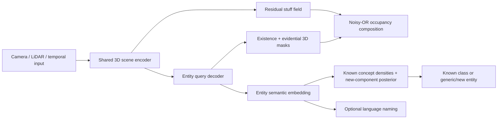

# 从第一性原理设计统一的开放世界 3D Occupancy

日期：2026-08-27

本文提出一个新的方法框架，而不是对 ProOOD 做 incremental modification。为了便于讨论，我把它暂时称作：

> **NEO-Occ: Nonparametric Evidential Object-centric Occupancy**

它不是一篇现成论文的复述，而是从任务本身应满足的概率结构出发，再吸收 open-set recognition、evidential mapping、mask-level recognition、Bayesian nonparametrics 和 open-vocabulary representation 中真正兼容的部分。

## 0. 结论先行

最符合直觉、也最统一的方案不是：

- 一个 occupancy head；
- 一个 K+1 semantic head；
- 再外挂 prototype distance、energy、entropy、feature norm 等多个 OoD score。

我更推荐把任务定义成：

> **从传感器观测中推断一个由 `stuff field + 一组 object entities` 组成的随机 3D 世界；每个 entity 的语义来自“有限个已知概念 + 可生成新概念的非参数分布”。**

模型只需要回答四个本质问题：

1. 这里有多少 occupied evidence？
2. 这些 occupied voxels 是否组成一个独立 entity？
3. 这个 entity 能否被现有已知概念解释？
4. 如果不能，它是否应当成为一个新的 concept/track？

因此：

- `free / occupied` 是几何状态；
- `observed / unobserved` 是证据状态，不是几何类别；
- `object / stuff` 是场景组成方式；
- `known / new` 是知识库对 entity 的解释能力；
- `sofa / tire / fallen log` 等名称只是 new entity 的可选语言解释。

`unknown` 不再是一类物体，而是一个事件：

$$
\text{unknown} \equiv \text{the entity is not explained by any current known concept}.
$$

这是整套方法最核心的统一原则。

---

## 1. 为什么现有常见定义在根本上不够干净

### 1.1 `unobserved` 不是第三种世界状态

真实世界中的 voxel 要么 free，要么 occupied；`unobserved` 描述的是传感器没有提供足够证据。

因此，不应使用一个 softmax 强迫模型在下面三类中互斥选择：

$$
\{\text{free},\ \text{occupied},\ \text{unobserved}\}.
$$

一个 unobserved voxel 仍然可以根据上下文被预测为 occupied，只是预测应当带有更低的直接观测证据。更合理的输出是两个量：

$$
P(O_v=1\mid X),
\qquad
E_v^{\text{obs}},
$$

其中第一个量描述世界状态，第二个量描述该位置被传感器直接支持了多少。

### 1.2 `unknown` 不是可以被压成一个中心的第 K+1 类

car、pedestrian 各自具有相对稳定的类内结构；但 sofa、轮胎、倒下的树、纸箱和将来尚未想到的物体之间没有共同语义中心。

若用 K+1 softmax 训练：

$$
Y\in\{1,\ldots,K,\text{unknown}\},
$$

模型学到的是“训练时那批 generic proxy 的分布”，而不是“已知知识的边界”。它可能很好地重新识别训练中出现过的沙发和轮胎，却仍然把全新的物体高置信度预测成 car。

### 1.3 OoD 应当在 object/entity 层判断

“这个 voxel 是不是新类别”本身不是很自然的问题。一个 voxel 只包含局部表面、颜色或纹理；新颖性通常属于完整对象。

同一个 sofa 上不同 voxel 的局部特征差异可能大于 sofa 和 car 的某些局部表面差异。逐 voxel 判 OoD 会产生：

- 物体内部碎片化；
- 边界高 uncertainty；
- 小目标 evidence 太弱；
- 同一物体不同区域给出矛盾结论。

如果先形成 entity，再在整个 mask 上积累语义 evidence，统计强度会显著更高。这与 mask-level anomaly segmentation 的经验结果一致，但在 NEO-Occ 中它不是 post-processing，而是模型的基本随机变量。

### 1.4 Open vocabulary 不能定义真正的 unknown

CLIP/VLM 对任意输入和任意文本列表总能返回一个最相似类别。它解决的是：

> “在给定词表中，它最像哪个名字？”

而不是：

> “当前知识库是否足以解释这个对象？”

因此语言模型应当为新 entity 提供命名 prior，而不能取代 known/new inference。

---

## 2. 统一的世界模型

### 2.1 隐变量

给定传感器输入 $X$，模型推断以下随机变量：

- $S_v\in\{0,1\}$：voxel $v$ 是否属于非实例化的 occupied stuff；
- $B_q\in\{0,1\}$：第 $q$ 个 entity query 是否真实存在；
- $M_{qv}\in\{0,1\}$：voxel $v$ 是否属于 entity $q$；
- $z_q\in\mathbb{S}^{d-1}$：entity $q$ 的单位球面语义 embedding；
- $C_q\in\{1,\ldots,K,\text{new}\}$：entity 属于已知概念还是一个新概念；
- $E_v^{\text{obs}}$：voxel 的直接观测 evidence。

这里的 `stuff` 不是 semantic background class，而是没有必要实例化的 occupied residual，例如大面积建筑、植被或其他没有实例监督的背景结构。

### 2.2 Occupancy 不是单独 head，而是 scene decomposition 的结果

voxel occupied 当且仅当它属于 stuff，或者属于至少一个存在的 entity：

$$
O_v = S_v \lor \bigvee_{q=1}^{Q}(B_q\land M_{qv}).
$$

其概率可以写成 noisy-OR：

$$
P(O_v=1\mid X)
=1-
\bigl(1-P(S_v=1\mid X)\bigr)
\prod_{q=1}^{Q}
\left(1-P(B_q=1\mid X)P(M_{qv}=1\mid X)\right).
$$

这个定义有三个直接好处：

1. 几何 occupancy 和 entity masks 天然一致，不需要两个 head 再加 consistency hack；
2. unknown entity 即使没有任何已知语义，仍会可靠贡献 occupied probability；
3. 未标注的树、建筑等可以由 $S_v$ 解释，不必错误地充当 unknown-object 训练样本。

### 2.3 一个 scene decoder，而不是多个彼此竞争的 task heads

推荐的计算图是：



`stuff field` 和 `entity queries` 不是两个任务 head，而是同一个生成式 scene decomposition 中的两类 latent component。

---

## 3. 用共轭证据分布统一 geometry uncertainty

### 3.1 LiDAR mapping GT 不再是 hard label

对 voxel $v$，令：

- $n_v^{\text{hit}}$：LiDAR return 落入该 voxel 的加权次数；
- $n_v^{\text{pass}}$：LiDAR ray 穿过该 voxel 的加权次数。

用 Beta-Bernoulli 表示 occupancy posterior：

$$
O_v\sim\operatorname{Bernoulli}(\theta_v),
\qquad
\theta_v\sim\operatorname{Beta}(a_v,b_v),
$$

$$
a_v^*=a_0+w_h n_v^{\text{hit}},
\qquad
b_v^*=b_0+w_f n_v^{\text{pass}}.
$$

则：

$$
\mathbb E[\theta_v]
=\frac{a_v^*}{a_v^*+b_v^*},
\qquad
E_v^{\text{obs}}
=a_v^*+b_v^*-a_0-b_0.
$$

解释如下：

- hit 多、pass 少：occupied 且 evidence 高；
- pass 多、hit 少：free 且 evidence 高；
- hit 和 pass 都没有：保持 prior，表示 unobserved；
- hit 和 pass 同时较多：存在运动补偿误差、动态物体或建图冲突，应保留冲突而不是粗暴二值化。

如果需要显式区分“无证据”和“互相冲突的证据”，可以使用 EvOcc 式 Dempster-Shafer mass；但在二元 occupancy 分支上，Beta sufficient statistics 已经是一个很干净、容易实现的起点。

### 3.2 Query mask 也使用 Beta evidence

对每个 entity mask：

$$
M_{qv}\sim\operatorname{Bernoulli}(\rho_{qv}),
\qquad
\rho_{qv}\sim\operatorname{Beta}(\alpha_{qv},\beta_{qv}).
$$

于是：

- mask probability 为 $\alpha/(\alpha+\beta)$；
- mask confidence 由 $\alpha+\beta$ 表示；
- 边界模糊和 evidence 不足不再混成同一个 entropy；
- 一个 query 的 objectness 可以对整个 mask 的 evidence 聚合。

这比对 voxel logits 求 entropy 更接近“模型是否有证据认为这些 voxels 属于同一个对象”。

---

## 4. Unknown 的核心：有限已知原子 + 非参数 new component

### 4.1 已知类不是单 prototype，而是概率密度

让 object embedding 位于单位超球面：

$$
z_q\in\mathbb S^{d-1},
\qquad \|z_q\|_2=1.
$$

每个 known class $k$ 使用一个 von Mises-Fisher mixture 表达多模态类内分布：

$$
p_k(z)
=
\sum_{m=1}^{M_k}
\pi_{km}
C_d(\kappa_{km})
\exp\!\left(\kappa_{km}\mu_{km}^{\top}z\right).
$$

这比单 prototype 更合理，因为同一个 car 类可能包含：

- 不同车型；
- 不同视角；
- 不同距离和 LiDAR sparsity；
- camera/LiDAR domain variation。

单位球面消除了把 feature norm 当成另一个独立 heuristic score 的需要；方向表示语义，浓度 $\kappa$ 表示该 known mode 的覆盖范围。

### 4.2 `new` 是 Bayesian model selection，不是分类 logit

在现有 $K$ 个 known concepts 之外，引入一个 Bayesian nonparametric base measure $p_0(z)$。最简单的实现是在单位球面上使用 uniform base density：

$$
p_0(z)=\frac{1}{\operatorname{Area}(\mathbb S^{d-1})}.
$$

给定 known concept 的有效样本量 $n_k$ 和 new-concept concentration $\gamma$，entity 的后验为：

$$
P(C_q=k\mid z_q,\mathcal D)
=
\frac{n_k p_k(z_q)}
{\gamma p_0(z_q)+\sum_{j=1}^{K}n_jp_j(z_q)},
$$

$$
P(C_q=\text{new}\mid z_q,\mathcal D)
=
\frac{\gamma p_0(z_q)}
{\gamma p_0(z_q)+\sum_{j=1}^{K}n_jp_j(z_q)}.
$$

这可以理解成一个“已知 atoms + Dirichlet-process residual”的 posterior predictive rule：

- 若某个 known density 能很好解释 $z_q$，模型输出 known class；
- 若所有 known densities 都很小，new-component posterior 自动升高；
- 新类别加入知识库时，只需把其 cluster/density 从 residual 提升为新的 atom；
- 模型输出维度不需要从 K+1 重新训练为 K+2。

### 4.3 为什么它比 distance threshold 更统一

prototype distance 只回答“离中心多远”，却没有表达：

- 类内方差；
- 多模态结构；
- 类别样本量；
- known/new prior；
- 错误决策的代价。

上面的 posterior 将这些量放进同一个概率比。最终 decision threshold 也不必凭经验设成 0.5，而可以由安全代价决定。

若漏掉未知障碍的代价为 $C_{\text{miss}}$，错误拒绝已知物体的代价为 $C_{\text{reject}}$，则选择 `new` 的 Bayes rule 为：

$$
P(\text{new}\mid z_q)
>
\frac{C_{\text{reject}}}
{C_{\text{reject}}+C_{\text{miss}}}.
$$

自动驾驶中通常 $C_{\text{miss}}\gg C_{\text{reject}}$，因此系统可以有原则地偏向安全拒识。

---

## 5. Generic objects 应当怎样用于训练

### 5.1 不把它们当成同一个类别

对于每个插入的 sofa、tire、fallen log，插入管线天然知道 mesh、pose 和 instance ID。它们应提供：

1. occupied geometry supervision；
2. entity mask / existence supervision；
3. `new component` supervision；
4. 同一 instance 在多帧、多视角下的 embedding consistency。

但它们不应共享一个 semantic prototype。对 generic entity $q$ 使用：

$$
\mathcal L_{\text{generic}}
=-\log P(C_q=\text{new}\mid z_q),
$$

而不是：

$$
\mathcal L_{K+1}
=-\log P(Y_q=\text{unknown-class}).
$$

前者只要求每个 generic entity 离开所有 known support；后者会把所有 generic objects 拉向同一个 artificial class center。

### 5.2 Generic instance 之间只建立“同物体一致性”

对同一物体的不同观测 $z_{q,t}$，使用层次生成模型：

$$
z_{q,t}\sim\operatorname{vMF}(\bar z_q,\kappa_{\text{view}}).
$$

这会自然产生 temporal/view consistency。不同 generic objects 之间不需要彼此接近，也不必强制远离；它们可以各自形成新的 latent component。

### 5.3 未标注背景 occupied voxels 怎么办

树、建筑、普通路牌等没有类别或实例标注的 occupied voxels：

- 参与 occupancy/evidence likelihood；
- 默认由 residual stuff field 解释；
- semantic loss mask 掉；
- 不自动当作 generic/new object 负样本或正样本。

这点非常重要。`unlabeled` 的含义是“不知道标签”，不是“已知它属于 unknown object”。

如果你的任务最终只关心碰撞，背景结构和道路上的沙发都应输出 occupied；如果还要输出“道路上出现了一个意外对象”，则由 entity query 加上与 drivable surface 的空间关系来回答，而不是让 semantic head 猜测“背景”还是“异常”。

---

## 6. Open vocabulary 如何自然并入，而不是成为另一个外挂 head

### 6.1 在同一个 object embedding space 中加入语言先验

使用 image-language 或 point-language teacher，让 entity embedding $z_q$ 与 object-level language embedding 对齐。已知类中心可以写成：

$$
\mu_k
=\operatorname{normalize}(A t_k+\Delta_k),
$$

其中：

- $t_k$ 是文本 prompt embedding；
- $A$ 是 modality adapter；
- $\Delta_k$ 是从真实 3D 数据学习到的修正。

因此文字不是另一个分类 head，而是 known/new concept density 的 prior。

### 6.2 推理时先发现，再命名

正确顺序是：

1. class-agnostic query 判断这里是否有 entity；
2. Bayesian posterior 判断它能否被部署时的 known taxonomy 解释；
3. 若为 `new`，再查询开放文本库或 VLM，生成可选名称；
4. 安全接口仍保留 `generic object`，文本名称不能覆盖 rejection 结果。

例如，模型可以同时输出：

```text
entity_id: 17
existence: 0.98
occupied_volume: 1.4 m^3
P(new): 0.94
safety_label: generic_object
optional_name: "sofa" (text similarity 0.71)
```

这同时解决了：

- VLM 可能知道 sofa，但你的部署 taxonomy 不包含 sofa；
- VLM 完全不知道某个新物体；
- 用户临时加入新的文本 query；
- 将来给 cluster 标注后增量扩展 taxonomy。

---

## 7. 一个统一训练目标：scene model 的负 ELBO

把完整隐世界记作：

$$
W=\{S, B_{1:Q},M_{1:Q},z_{1:Q},C_{1:Q}\}.
$$

训练目标可以统一写成：

$$
\mathcal L_{\text{NEO-Occ}}
=
-\mathbb E_{q_\phi(W\mid X)}
\left[
\log p(E_{\text{ray}},Y_{\text{known}},I_{\text{entity}}\mid W)
\right]
+
\operatorname{KL}
\left(q_\phi(W\mid X)\Vert p(W)\right).
$$

工程实现时它会展开为几项，但这些不是随意拼起来的 loss，而是同一概率图的 likelihood/prior：

$$
\begin{aligned}
\mathcal L
=\;&
\mathcal L_{\text{ray-evidence}}
+\mathcal L_{\text{set-mask}}
+\mathcal L_{\text{known-density}}
+\mathcal L_{\text{new-component}}
+\mathcal L_{\text{entity-prior}}.
\end{aligned}
$$

分别对应：

- `ray-evidence`：Beta occupancy posterior 与 LiDAR hits/transmissions 一致；
- `set-mask`：用 permutation-invariant matching 学习 query existence 和 instance masks；
- `known-density`：已知 entity 在正确 vMF mixture 下具有高 likelihood；
- `new-component`：generic entity 对 DP residual 具有高 posterior；
- `entity-prior`：同一 entity 跨帧一致，并控制无效/重复 queries。

如果直接使用 raw LiDAR rays，也可对 first return 建模：

$$
p(r\text{ hits voxel }j\mid O)
=
P(O_j=1)
\prod_{i<j}P(O_i=0).
$$

这比先生成 hard free/occupied GT 再训练更接近真实传感器生成过程。

---

## 8. 训练数据的准确使用方式

| 数据类型 | Geometry / occupancy | Entity mask | Known density | New-component posterior |
|---|---:|---:|---:|---:|
| observed free ray | free evidence | 不参与 | 不参与 | 不参与 |
| known car/ped voxel | occupied evidence | 参与 | 对应 known class | known |
| inserted generic instance | occupied evidence | 参与，每个物体独立 ID | 不更新 known density | new |
| unlabeled tree/building/sign | occupied evidence | 默认不参与，进入 stuff residual | mask 掉 | mask 掉 |
| unobserved voxel | 无 hard loss | 无 hard loss | 无 | 无 |
| conflicting mapping voxel | soft/evidential target | 低权重或 soft target | 视语义证据而定 | 视实例证据而定 |

### Taxonomy episodic training

仅靠固定 known taxonomy 训练，encoder 仍可能把“从未被当作 unknown 的 held-out 类”折叠到最近 known mode。解决办法不是继续加 OoD score，而是在训练中随机改变知识库：

1. 每个 episode 从有标签 classes 中采样 active known set $\mathcal K_e$；
2. 剩余类别在该 episode 中仍是 occupied entity，但按 `new component` 处理；
3. 下一 episode 重新采样 taxonomy；
4. generic insertions 继续作为完全不同来源的 new concepts。

这等价于直接优化模型在“知识集合发生变化”条件下的 posterior predictive，而不只是记忆一套固定标签。

它应当是核心训练协议，而不是消融末尾的小 trick。

---

## 9. 推理输出应当长什么样

### 9.1 Voxel API

每个 voxel 输出：

```text
P_occupied
occupancy_evidence
direct_observation_evidence
entity_id or stuff
```

注意：不要把 `unobserved` 与 `occupied` 做成互斥类别。可以出现：

```text
P_occupied = 0.82
direct_observation_evidence = 0.00
occupancy_evidence = low
```

其含义是：该 voxel 没有被直接观测，但模型根据上下文认为它可能 occupied。

### 9.2 Entity API

每个 object query 输出：

```text
entity_id
existence_probability
3D mask posterior
known-class posterior
P_new
semantic embedding
optional open-vocabulary name
temporal track id
```

### 9.3 最终安全状态

planner 可以从概率输出派生：

- `FREE_CONFIRMED`：free probability 和 direct evidence 都高；
- `KNOWN_OBJECT(k)`：entity 存在且 known posterior 高；
- `GENERIC_OBJECT`：entity 存在且 new posterior 高；
- `OCCUPIED_STUFF`：occupied 由 residual stuff field 解释；
- `LOW_EVIDENCE`：世界状态预测存在，但缺乏足够观测/模型 evidence。

这些是决策接口，不是单个 softmax 的五个互斥训练类别。

---

## 10. 为什么从理论上它应当比现有组合更有效

### 10.1 Geometry 不会因 semantic OoD 而消失

occupancy 由 mask/stuff 的几何概率直接组成。一个新物体不需要先被某个 known semantic prototype 接受，才能成为 occupied。

这避免了 prototype-guided semantic completion 把 unknown 吸入 known class 的结构性风险。

### 10.2 Unknown posterior 对 known support 具有单调性

固定 $p_0$ 和 prior 后，当所有 $p_k(z)$ 同时下降时：

$$
P(\text{new}\mid z)
=
\frac{\gamma p_0(z)}
{\gamma p_0(z)+\sum_kn_kp_k(z)}
$$

必然上升。这比 `max(entropy, distance, energy)` 更容易解释和校准。

### 10.3 不假设 unknown 是单峰分布

所有 unknown 共享的是“无法被 known atoms 解释”这个逻辑事件，而不是 appearance distribution。每个新 entity 可以在 DP residual 下形成自己的 component。

### 10.4 Object-level evidence 的信噪比更高

如果同一 object 的多个 voxel/帧在条件独立近似下提供 evidence，其 log likelihood ratio 可累加：

$$
\log\Lambda_q
=
\sum_{v\in M_q}
\log
\frac{p(f_v\mid\text{known})}
{p(f_v\mid\text{new})}.
$$

即使单 voxel evidence 很弱，完整 entity 和 temporal track 仍可形成稳定判断。mask-level anomaly segmentation 的实证也支持先聚合 region evidence 再拒识。

### 10.5 新类可以被真正吸收到知识库中

一批持续出现的 `new` tracks 可以形成 cluster。人工给 cluster 标注后：

1. 将 cluster density 从 DP residual 提升为新的 known atom；
2. 给它绑定文本名称；
3. 不改 occupancy decoder；
4. 不改变原有 K 维 classifier head，因为根本没有固定 K+1 output head。

这才是真正的 open-world/incremental representation。

---

## 11. 与几个主要方案的本质区别

| 方案 | 它把 unknown 当成什么 | 根本限制 | NEO-Occ 的处理 |
|---|---|---|---|
| K+1 semantic softmax | 一个普通类别 | unknown 分布不可能单峰且有限 | `new concept` posterior |
| ProOOD | 偏离 known prototypes 的 voxels | voxel-level；prototype completion 可能同化 unknown | object density + geometry-independent discovery |
| LIDO | prototype distance、entropy、norm 的融合 | 多个 score 缺乏统一概率语义；point-level | 单一 posterior predictive ratio |
| ULOPS/U3HS | Dirichlet uncertainty 高的区域 | evidence 常由网络直接输出，未必随 known density 降低 | density-derived semantic evidence |
| Prior2Former | mask query 的 Beta evidence | 主要解决 2D mask uncertainty，没有开放语义生长模型 | Beta masks + nonparametric semantic concepts |
| POP-3D/OVO/AGO | 可与文本匹配的 voxel embedding | 给定词表 forced matching 不是拒识 | language 是 new component 的命名 prior |
| DOODLE/重建式方法 | 无法重建的输入 | 强生成器也可能重建 unknown；raw likelihood 受低级统计主导 | 在 object semantic manifold 上做 likelihood ratio/model selection |

---

## 12. 为什么不直接使用一个强大的 generative world model

“训练一个模型生成所有正常场景，重建不了的就是异常”看起来很第一性原理，但存在两个根本问题：

1. likelihood 往往被背景、纹理、点密度等低级统计支配，而不是 semantic novelty；
2. 强生成模型可能很好地重建 unknown，弱生成模型又会把正常长尾误报为 unknown。

因此，NEO-Occ 的生成建模对象不是 raw sensor pixels/points，而是：

- ray 与 occupancy 的物理生成关系；
- occupied scene 的 entity composition；
- entity-level semantic representation 的 known/new posterior predictive。

这将生成模型的归纳偏置放在任务真正关心的变量上。

---

## 13. 推荐实现路线

### Phase A：验证核心假设

先不要做完整 DP online learning，只验证三个核心点：

1. 现有 occupancy backbone 改成 `stuff field + Q entity masks`，occupancy 用 noisy-OR 得到；
2. entity embedding 上拟合多模态 vMF known densities；
3. 使用 uniform base density 计算 closed-form $P(\text{new})$。

generic insertions 每个对象都有独立 instance ID，只监督 `new posterior`，不建立 unknown prototype。

### Phase B：让训练和部署 taxonomy 可变化

加入 taxonomy episodic training：每轮随机 hold out 一部分 known classes，当作 new component。验证真正没在该 episode 的 active taxonomy 中出现的类别。

### Phase C：真正的 open-world memory

对跨帧 generic tracks 做 online Bayesian clustering：

- 同一 track 聚合 posterior；
- 稳定 unknown tracks 形成候选 concept cluster；
- 人工标注少量 cluster；
- 把 cluster 升级为 known density atom。

### Phase D：语言命名

最后才加入 VLM/object captioning。它只为已有 entity/cluster 提供名称和 semantic prior，不参与是否 occupied 的决策。

---

## 14. 最重要的对照实验

为了证明这是统一建模带来的收益，而不是 query 数或 backbone 容量，至少做：

1. `K+1 voxel softmax`；
2. `binary occupancy + K+1 semantic`；
3. `voxel prototype rejection`；
4. `entity query + K+1 semantic`；
5. `entity query + single-prototype rejection`；
6. `entity query + vMF mixture + new posterior`；
7. 上一项加 taxonomy episodic training；
8. 上一项加 generic new-component supervision；
9. 上一项加 temporal Bayesian aggregation；
10. 最后加 optional language naming。

核心指标应分开报告：

- geometry：occupied IoU、free-space precision、ray IoU；
- known semantics：known mIoU、tail-class IoU；
- unknown voxel：AuPRC、FPR95；
- unknown entity：object recall、object precision、PQ/UQ；
- safety：missed unknown obstacles、false unknown objects/km；
- calibration：known/new Brier score、ECE、risk-coverage curve；
- continual learning：新 concept 加入前后性能，以及旧类 forgetting。

最关键的结果不是 AUROC 单点提升，而是：

> 在固定 known-object false rejection rate 下，是否显著提高真正 unseen entity 的 recall，同时 occupancy IoU 不下降。

---

## 15. 必须诚实承认的理论边界

### 15.1 不存在能保证检测任意 OoD 的模型

如果一个 unseen object 在传感器观测和 learned representation 中与 known car 完全不可区分，则任何算法都无法知道它是新类别。这是信息不足，不是 loss 设计问题。

### 15.2 `unknown` 永远相对于 taxonomy

VLM 可能认识 sofa，但你的部署 taxonomy 只有 car/pedestrian。此时 sofa 对 VLM 是 known concept，对安全 taxonomy 仍是 `new`。系统必须显式保存“相对于哪个知识库”的定义。

### 15.3 Base measure 仍然是一种 prior

uniform sphere $p_0$ 是最少假设的起点，但不是宇宙中所有未知物体的真实分布。generic insertions、held-out episodes 和真实 validation anomalies 的作用是校准这个 prior，而不是宣称它们穷举了 unknown。

### 15.4 Object/stuff 分解需要数据定义

树可以是 stuff，倒下的树干可以是 object；路牌既可以是结构，也可以是独立实例。这不是模型能凭空解决的哲学问题。最稳定的工程定义是：

- `object`：有限范围、需要作为整体跟踪或规划避障的 entity；
- `stuff`：无需个体身份的连续 occupied field；
- “是否位于道路上”作为 entity 与 drivable surface 的关系输出。

---

## 16. 与现有工作的关系和研究依据

这套设计受以下工作启发，但没有直接复制其中任何一种 pipeline：

- [EvOcc](papers/EvOcc.pdf)：把 free transmissions、semantic returns、unlabeled occupied returns 和 uncertainty 建模为不同 evidence，而不是硬标签。
- [Prior2Former](https://arxiv.org/abs/2504.04841)：证明 mask-query 的 Beta evidence 可以在不使用 OoD 训练数据时支持 unknown instance segmentation。
- [U3HS / Holistic Segmentation](https://arxiv.org/abs/2209.05407)：unknown 应先被发现为 uncertain region/entity，再形成实例，而不是依赖训练 void class。
- [Mask-level Recognition for Outlier-aware Segmentation](https://arxiv.org/abs/2301.03407)：region/mask-level evidence aggregation 比独立 pixel decision 更适合 anomaly segmentation。
- [Posterior Network](https://proceedings.neurips.cc/paper/2020/hash/0eac690d7059a8de4b48e90f14510391-Abstract.html)：用 class-conditional density 产生 pseudo-count/evidence，使 uncertainty 与数据支持度建立联系。
- [AGO](https://arxiv.org/abs/2504.10117)：语言 grounding 有助于 label-space expansion，但 alignment 与 closed-set grounding 存在 modality conflict，且 open-world identifier 仍依赖 entropy/confidence selection。
- [GaussTR](https://arxiv.org/abs/2412.13193)、[OVO](https://arxiv.org/abs/2305.16133)：foundation-model alignment 能给 occupancy 提供开放语义，但它解决命名/查询，不自动解决 calibrated rejection。
- [Likelihood Ratios for OoD Detection](https://proceedings.neurips.cc/paper/2019/hash/1e79596878b2320cac26dd792a6c51c9-Abstract.html)：单独 generative likelihood 容易被背景统计影响，density ratio 更可靠。
- [Why Normalizing Flows Fail to Detect OoD](https://proceedings.neurips.cc/paper/2020/hash/ecb9fe2fbb99c31f567e9823e884dbec-Abstract.html)：强 density estimator 本身并不保证 semantic OoD detection，模型归纳偏置决定它在测量什么。
- 本地已经审计的 [ProOOD](papers/ProOOD.pdf)、[LIDO](papers/LIDO.pdf)、[LiPSOW](papers/LiPSOW.pdf) 说明 prototype、objectosphere 与 object grouping 都有价值，但还没有把 geometry evidence、entity discovery、known support 和 concept growth 放进同一个概率模型。

---

## 17. 最终建议

如果目标是做一项不仅有效、而且有清晰方法论贡献的研究，我建议将论文主命题定成：

> **Open-world occupancy is Bayesian entity-set inference, not voxel-wise K+1 classification.**

最值得作为主要创新的三个部分是同一模型的三个层次：

1. **Evidential scene composition**：occupancy 由 stuff 和 entity masks 的概率并集定义，observability 作为独立 evidence；
2. **Nonparametric semantic rejection**：unknown 是 known concept densities 之外的新 component posterior；
3. **Taxonomy-variable learning**：通过 episodic knowledge sets 学习“知识边界会变化”，并允许 unknown clusters 被提升为新 known atoms。

这比“ProOOD + LIDO score + ULOPS loss + connected components”更简洁。它不需要发明很多互不相关的分数；所有输出都来自一个关于 3D 世界如何由 evidence、stuff、entities 和 concepts 生成的概率模型。
