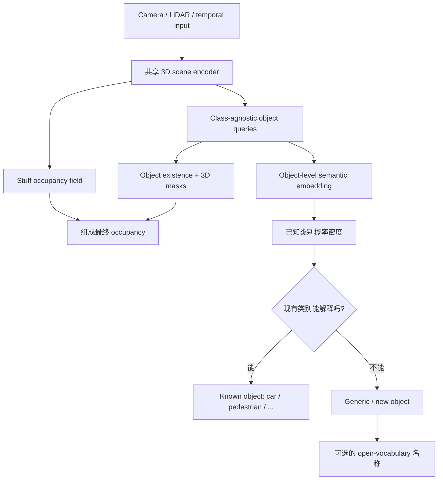

# 开放世界 Occupancy：直觉版思路、结论与参考文献

日期：2026-08-28

这份文档用尽量直观的方式解释：如何让 occupancy 网络既预测普通汽车、行人，也能发现沙发、轮胎、倒下的树干等从未见过的道路障碍物。

更完整的概率模型和公式见：[FIRST_PRINCIPLES_UNIFIED_METHOD.md](FIRST_PRINCIPLES_UNIFIED_METHOD.md)。

---

## 1. 我们真正要解决的问题

你的数据里存在四种情况：

1. **Free space**：LiDAR ray 穿过，说明这里基本是空的。
2. **Known occupied object**：例如 car、pedestrian，既有 occupancy 标注，也有 semantic 标注。
3. **Unlabeled occupied background**：例如建筑、树木、普通路牌。我们知道这里 occupied，但没有细分类别标注。
4. **Generic object**：例如插入到道路上的沙发、轮胎、纸箱、倒下的树干。我们知道它是一个完整物体，但它不属于现有的 car、pedestrian 等类别。

除此之外，还有一种数据状态：

5. **Unobserved**：LiDAR 从未覆盖这里，因此不知道它究竟 free 还是 occupied。

这里最容易犯的错误，是把这些情况全部塞进一个 semantic softmax：

```text
free / car / pedestrian / unknown object / unobserved
```

它们其实不是同一种概念：

- free/occupied 描述几何；
- car/pedestrian 描述语义；
- known/unknown 描述模型是否认识这个物体；
- observed/unobserved 描述传感器有没有提供证据。

因此，这些信息不应被强迫成互斥类别。

---

## 2. 最核心的结论

### 结论一：unknown 不应该是普通的第 K+1 类

car 类里的样本都具有一定共同结构，pedestrian 也一样。

但下面这些物体没有共同的外观或几何中心：

```text
沙发、轮胎、纸箱、石头、倒下的树干、散落货物、未来尚未见过的物体……
```

如果把它们全部训练成 `unknown object` 类，网络主要会学会重新识别训练时见过的那批 generic objects。例如，它可能认识训练中的沙发和轮胎，但仍将第一次出现的手推车高置信度预测成 pedestrian。

更合理的定义是：

> **Unknown 不是一种物体，而是“这个物体不能被任何现有已知类别合理解释”。**

### 结论二：先发现“这里有一个物体”，再判断“是否认识它”

传统 detector 经常将 objectness 和 known-class classification 绑得太紧：如果一个区域不像任何已知类，它连 object proposal 都可能没有。

我们应当分成两个问题：

1. 这里是否存在一个有完整空间范围的物体？
2. 这个物体是否属于当前已知类别？

第一个问题只依赖几何、边界、空间连通性和时序一致性，不依赖它是不是 car。

### 结论三：unknown 应当在完整 object/entity 上判断

单个 voxel 只看到了物体的一小块表面。沙发的金属脚可能像自行车的一部分，树干的局部表面可能像 vegetation。

将同一物体的所有 voxels 和多个时间帧聚合后，模型获得的证据更稳定。因此模型的基本输出应该包含一组 3D object masks，而不只是每个 voxel 独立分类。

### 结论四：Open vocabulary 用来命名，不应单独承担拒识

CLIP 一类模型总能从给定文本中选出“最像”的名称。即使输入是完全陌生物体，它也会返回一个答案。

因此正确顺序是：

```text
发现物体
    ↓
判断现有类别能否解释它
    ↓
不能解释 → 输出 generic object
    ↓
可选：使用语言模型猜测它可能是 sofa / tire / log
```

安全输出仍然是 `generic object`；文本名称只作为额外信息。

---

## 3. 推荐的统一场景表示

把整个 occupied 场景看成两部分：

### 3.1 Stuff field

用于表示不需要单独实例身份的 occupied 背景，例如：

- 大面积建筑；
- 路边植被；
- 墙体；
- 其他只有 occupancy、没有实例标签的背景结构。

它只需要回答“这里是否 occupied”，不需要猜测具体类别。

### 3.2 Object entities

网络同时输出一组 object queries。每个 query 表示一个可能存在的完整物体，并输出：

```text
是否存在
占据哪些 3D voxels
物体级 semantic embedding
属于各个 known class 的概率
属于 new/unknown concept 的概率
```

汽车、行人、沙发、轮胎和倒下的树干都可以由 object query 表示。区别只在于：汽车可能被 known car distribution 解释，沙发则不能。

最终 occupancy 是：

```text
occupied = stuff field ∪ 所有存在的 object masks
```

这样，一个从未见过的新物体即使没有名字，也一定可以贡献 occupied voxels。

---

## 4. 整体网络流程



它看起来有多个输出，但它们不是互相独立的工程模块，而是在描述同一个 3D 世界：

- stuff 和 objects 共同解释 occupancy；
- object mask 定义物体在哪里；
- semantic distribution 判断知识库能否解释该物体。

---

## 5. 模型如何判断 known 或 unknown

### 5.1 不再只学习一个 prototype

一个类别内部往往有多个模式。例如 car 包含：

- 轿车、SUV、面包车；
- 正面、侧面、背面；
- 近距离稠密点云和远距离稀疏点云。

因此，每个 known class 应学习一个多模态概率分布，而不只是一个平均 prototype。

可以将其理解为：

```text
car distribution       = 若干个 car feature clusters
pedestrian distribution = 若干个 pedestrian feature clusters
...
```

### 5.2 Unknown 是“新成分”的后验概率

对于检测到的 entity，比较两种解释：

```text
解释 A：它来自某个已经学过的 known-class distribution
解释 B：它需要建立一个新的 semantic component
```

简化后的核心概率是：

$$
P(\text{new}\mid z)
=
\frac{\text{new-concept prior}}
{\text{new-concept prior}+\text{所有 known classes 对它的解释能力}}.
$$

如果 car、pedestrian 等所有已知分布都无法解释这个 object embedding，`P(new)` 就会自然升高。

这与 prototype distance threshold 的区别是：它同时考虑类别的覆盖范围、多种模式、先验和类别不平衡，而且输出具有统一的概率含义。

---

## 6. 你的各种 GT 应当如何使用

| GT 类型 | Occupancy 训练 | Object mask 训练 | Known semantic 训练 | Unknown/new 训练 |
|---|---:|---:|---:|---:|
| LiDAR 穿过的 free voxel | 是 | 否 | 否 | 否 |
| car / pedestrian | 是 | 是 | 是 | 监督为 known |
| 插入的沙发、轮胎、树干 | 是 | 是，每个实例独立 | 否 | 监督为 new |
| 未标注的树、建筑、路牌 | 是 | 默认否，进入 stuff | 否 | 否 |
| LiDAR 没覆盖的 voxel | 否 | 否 | 否 | 否 |
| 建图证据冲突的 voxel | soft target | 低权重或 soft | 视标签证据决定 | 视实例证据决定 |

最关键的三条规则是：

1. `unlabeled occupied` 不等于 `unknown object`；
2. generic objects 参加 occupancy 和 new-object 训练，但不参加 K 类 semantic cross-entropy；
3. unobserved voxels 不作为 free 训练。

---

## 7. Generic objects 的正确训练方式

假设训练场景中插入了三个物体：

```text
generic instance 1 = sofa
generic instance 2 = tire
generic instance 3 = fallen log
```

错误做法：

```text
让三个物体的 feature 全部接近同一个 unknown prototype
```

正确做法：

```text
三个物体都远离所有 known-class distributions
同一个物体跨 voxel、跨相机、跨时间的 feature 保持一致
不同 generic instances 可以位于完全不同的 feature 区域
```

因此训练信号是：

- sofa 不能被 car/pedestrian 解释；
- tire 不能被 car/pedestrian 解释；
- fallen log 不能被 car/pedestrian 解释；
- 但不要求 sofa、tire 和 log 在语义空间中彼此相似。

---

## 8. 如何让模型面对真正从未见过的类别

只使用沙发、轮胎等固定 generic 集合，模型仍可能记住这些物体。推荐增加 **taxonomy episodic training**：

假设完整训练标签包括：

```text
car, pedestrian, bicycle, motorcycle, truck
```

某一个训练 episode 临时规定：

```text
known = car, pedestrian, bicycle
new   = motorcycle, truck
```

下一个 episode 可以规定：

```text
known = car, motorcycle, truck
new   = pedestrian, bicycle
```

这样，模型训练的就不是固定的类别边界，而是：

> 给定一个当前知识集合，判断新 entity 是否能被这个知识集合解释。

再与真正的 generic insertions 一起训练，可以显著减少模型只记忆某几种 unknown proxy 的风险。

---

## 9. Observed、unobserved 和 uncertainty

### 9.1 建图时保留 LiDAR evidence

不要只为每个 voxel 保存一个 hard label。至少保存：

```text
hit_count       # 有多少 LiDAR returns 落在这里
pass_count      # 有多少 rays 穿过这里
semantic_count  # 各 known classes 的 return evidence
instance_id     # known 或插入物体的实例 ID
```

这样可以区分：

- `hit_count > 0`：存在 occupied evidence；
- `pass_count > 0`：存在 free evidence；
- 两者都为 0：unobserved；
- 两者都很高：可能存在动态物体、配准误差或时序冲突。

### 9.2 推理时不要把 unobserved 作为 semantic 类

一个没有被直接看到的 voxel，模型仍可以根据场景上下文预测其 occupancy，但需要同时报告较低的 observation evidence。

例如：

```text
P(occupied) = 0.80
direct observation evidence = 0.00
```

表示模型认为这里可能被遮挡物体占据，但没有直接 LiDAR 证据。

---

## 10. 推理结果示例

模型发现道路上有一个以前没见过的沙发，可以输出：

```yaml
entity_id: 17
existence_probability: 0.98
occupied_voxels: <3D mask>
known_class_probability:
  car: 0.03
  pedestrian: 0.01
  bicycle: 0.02
P_new: 0.94
safety_label: generic_object
optional_open_vocabulary_name:
  text: sofa
  similarity: 0.71
```

即使 open-vocabulary 模块没有猜出 `sofa`，前面的 occupancy、object mask 和 `generic_object` 仍然有效。

---

## 11. 最推荐的实现顺序

### 第一阶段：验证基本设计

1. 保留现有 3D scene encoder；
2. 输出 residual stuff occupancy；
3. 加入一组 class-agnostic 3D object queries；
4. occupancy 由 stuff 和 object masks 的并集组成；
5. 在 object-level embedding 上拟合 known-class distributions；
6. generic instances 只监督 `P(new)`，不建立 unknown prototype。

### 第二阶段：提升真正未见类别泛化

1. 加入 taxonomy episodic training；
2. known class 使用多模态分布；
3. 在 held-out known classes、插入 generic objects 和真实道路异常物体上分别测试。

### 第三阶段：时序与持续学习

1. 跨帧聚合同一个 unknown entity；
2. 稳定 unknown tracks 自动形成新 cluster；
3. 人工标注少量 cluster；
4. 将其加入 known concept bank，而不修改 occupancy 模型。

### 第四阶段：开放词汇命名

最后才加入 CLIP/VLM，为已经发现的 new entity 提供名称。它不参与 occupied 与否的安全决策。

---

## 12. 这个方法最值得验证的假设

论文实验应重点验证：

> 在相同的 known-object false rejection rate 下，object-centric new-component posterior 能否比 K+1 softmax 和 voxel-level prototype score 检出更多真正未见过的物体，同时不降低 occupancy IoU。

主要对照方法：

1. binary occupancy + K+1 semantic softmax；
2. voxel-level prototype rejection；
3. object query + K+1 semantic；
4. object query + known-class probability distributions；
5. 上一项加入 taxonomy episodic training；
6. 上一项加入 generic-object new-component supervision；
7. 上一项加入 temporal aggregation。

主要指标：

- Occupied IoU；
- known-class mIoU；
- unknown voxel AuPRC、FPR95；
- unknown object recall、precision；
- false unknown objects/km；
- missed unknown obstacles/km；
- known/new calibration；
- 新类别加入后的 continual-learning performance。

---

## 13. 最终结论

最合理的系统不是“三个 head 加很多 anomaly scores”，也不是简单增加一个 `unknown object` 类。

推荐的统一定义是：

> **Occupancy 是由 stuff 和一组 object entities 组成的 3D 世界；unknown 是某个 occupied entity 无法被当前 known concept distributions 解释、因而需要建立新 semantic component 的后验事件。**

对应到你的数据：

- car、pedestrian：occupied entity + known semantic；
- sofa、tire、fallen log：occupied entity + new semantic component；
- building、普通 tree、无标签背景：occupied stuff，不参与 unknown semantic 训练；
- free：有 ray transmission evidence；
- unobserved：没有足够测量证据，不当成 free；
- open vocabulary：只给 new entity 命名，不负责发现它。

如果要把它凝练成一句论文主张：

> **Unknown is not a class; it is the event that an occupied entity requires a new semantic component.**

---

## 14. 参考文献

### 与 3D occupancy 和建图 evidence 直接相关

1. **EvOcc: Evidential Semantic Occupancy Mapping**  
   关键价值：使用 LiDAR transmissions 表示 free evidence、returns 表示 occupied evidence，并显式保留 unlabeled occupied 和 uncertainty。  
   本地论文：[papers/EvOcc.pdf](papers/EvOcc.pdf)

2. **ProOOD: Prototypical Open-Set Semantic Occupancy Prediction**  
   关键价值：直接研究 voxel occupancy 中的 OoD 与 known prototypes；局限是主要在 voxel 级判断，而且 prototype-guided completion 可能把 unknown 拉向 known。  
   本地论文：[papers/ProOOD.pdf](papers/ProOOD.pdf)  
   本地代码：[repos/ProOOD](repos/ProOOD)

3. **Out-of-Distribution Semantic Occupancy Prediction / OccOoD**  
   关键价值：建立直接的 occupancy OoD benchmark 和 anomaly-aware semantic score。  
   本地论文：[papers/OccOoD.pdf](papers/OccOoD.pdf)  
   本地代码：[repos/OccOoD](repos/OccOoD)

4. **AGO: Adaptive Grounding for Open World 3D Occupancy Prediction**  
   关键价值：研究开放语言知识如何迁移到 3D occupancy，以及 closed-set grounding 和 image-language alignment 的冲突。  
   论文：[arXiv:2504.10117](https://arxiv.org/abs/2504.10117)

5. **POP-3D: Open-Vocabulary 3D Occupancy Prediction from Images**  
   关键价值：将 voxel features 与 CLIP language space 对齐；适合开放词汇命名，但没有可靠的 unknown rejection。  
   本地论文：[papers/POP3D.pdf](papers/POP3D.pdf)  
   本地代码：[repos/POP3D](repos/POP3D)

### 与 unknown object 和 object-level recognition 相关

6. **LIDO: LiDAR-only Domain-generalized Open-set Segmentation**  
   关键价值：学习 known support，结合 prototype distance 与 objectosphere representation；比 K+1 unknown class 更合理，但仍是 point-level score fusion。  
   本地论文：[papers/LIDO.pdf](papers/LIDO.pdf)  
   本地代码：[repos/LIDO](repos/LIDO)

7. **Segmenting Known Objects and Unseen Unknowns without Prior Knowledge / U3HS**  
   关键价值：不依赖训练 void class，先用 uncertainty 找 unknown regions，再用 instance-aware embeddings 形成独立对象。  
   论文：[arXiv:2209.05407](https://arxiv.org/abs/2209.05407)

8. **Prior2Former: Evidential Modeling of Mask Transformers for Assumption-Free Open-World Panoptic Segmentation**  
   关键价值：为 mask queries 建立 Beta evidence，在不使用 OoD 训练数据的条件下发现 unknown instances。  
   论文：[arXiv:2504.04841](https://arxiv.org/abs/2504.04841)  
   代码：[TUM-DAML/Prior2Former](https://github.com/TUM-DAML/Prior2Former)

9. **On Advantages of Mask-Level Recognition for Outlier-Aware Segmentation**  
   关键价值：实验证明先聚合 region/mask evidence，再进行 anomaly decision，优于完全独立的 pixel-level 判断。  
   论文：[arXiv:2301.03407](https://arxiv.org/abs/2301.03407)

10. **OWL / LiPSOW: Open-World LiDAR Panoptic Segmentation**  
    关键价值：将 unknown points 进一步组织成完整 object instances。  
    本地论文：[papers/LiPSOW.pdf](papers/LiPSOW.pdf)  
    本地代码：[repos/LiPSOW](repos/LiPSOW)

### 与概率密度、evidence 和 OoD 理论相关

11. **Posterior Network: Uncertainty Estimation without OOD Samples via Density-Based Pseudo-Counts**  
    关键价值：通过 class-conditional density 产生 evidence，使 uncertainty 与训练数据支持度相关，而不是让网络任意输出一个 confidence。  
    论文：[NeurIPS 2020](https://proceedings.neurips.cc/paper/2020/hash/0eac690d7059a8de4b48e90f14510391-Abstract.html)

12. **Likelihood Ratios for Out-of-Distribution Detection**  
    关键价值：说明单独 generative likelihood 容易被背景统计支配，likelihood ratio 更适合 OoD decision。  
    论文：[NeurIPS 2019](https://proceedings.neurips.cc/paper/2019/hash/1e79596878b2320cac26dd792a6c51c9-Abstract.html)

13. **Why Normalizing Flows Fail to Detect Out-of-Distribution Data**  
    关键价值：强大的 density estimator 本身不保证 semantic OoD detection，模型的 representation 和 inductive bias 决定 likelihood 实际测量了什么。  
    论文：[NeurIPS 2020](https://proceedings.neurips.cc/paper/2020/hash/ecb9fe2fbb99c31f567e9823e884dbec-Abstract.html)

14. **Towards Open Set Recognition / OpenMax**  
    关键价值：开放集识别的经典工作，指出 closed-set classifier 会在开放空间中对无意义或未见输入产生高置信度预测。  
    论文：[CVPR 2016](https://openaccess.thecvf.com/content_cvpr_2016/html/Bendale_Towards_Open_Set_CVPR_2016_paper.html)

### 与开放词汇 3D 表示相关

15. **OVO: Open-Vocabulary Occupancy**  
    关键价值：把 2D open-vocabulary segmentation knowledge 蒸馏到 3D occupancy。  
    论文：[arXiv:2305.16133](https://arxiv.org/abs/2305.16133)

16. **GaussTR: Foundation Model-Aligned Gaussian Transformer**  
    关键价值：通过 foundation-model-aligned 3D Gaussians 学习可用于 open-vocabulary occupancy 的 3D representation。  
    论文：[arXiv:2412.13193](https://arxiv.org/abs/2412.13193)

17. **3D-AVS: LiDAR-based 3D Auto-Vocabulary Segmentation**  
    关键价值：在推理时自动生成 scene vocabulary，减少开放词汇方法对人工 prompt list 的依赖。  
    论文：[CVPR 2025](https://openaccess.thecvf.com/content/CVPR2025/papers/Wei_3D-AVS_LiDAR-based_3D_Auto-Vocabulary_Segmentation_CVPR_2025_paper.pdf)

---

## 15. 本地相关材料

- 深入调研与代码审计：[REPORT.md](REPORT.md)
- 下载文件与 commit 清单：[MANIFEST.md](MANIFEST.md)
- 第一性原理完整方法设计：[FIRST_PRINCIPLES_UNIFIED_METHOD.md](FIRST_PRINCIPLES_UNIFIED_METHOD.md)
- 本文档：[NEO_OCC_INTUITIVE_EXPLANATION.md](NEO_OCC_INTUITIVE_EXPLANATION.md)
